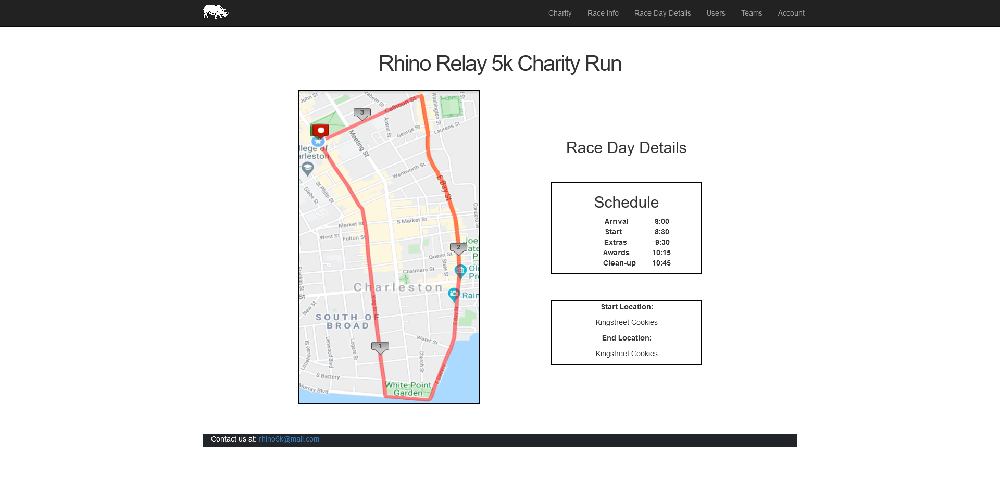
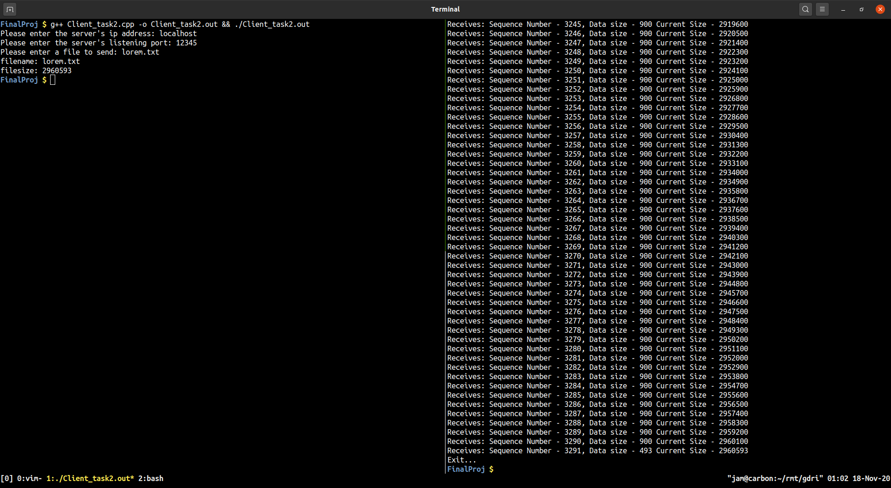

# Portfolio

## Programming Projects

\*For access to my private project repositories, please [email me](mailto:example@csustudent.net?subject=GitHub%20Access) with the subject line, GitHub Access.

---

### [Rhino 5K Website | CSCI 334 (UI Programming)](project1)

---

### [Simple UDP Client | CSCI 332 (Applied Networking)](project2)

---

## Ethics Papers

### [Ethics In Computing](https://drive.google.com/file/d/1KSX0cVkPLcjxjjJ5Z82oHBC1z7FOZY66/view?usp=sharing)

- **Class: CSCI 235**
- **Grade: B+**

---

Page template forked from <a href="https://github.com/csu-cs/csci-portfolio">CSU-CS</a>

<!-- Remove above link if you don't want to attributive -->
